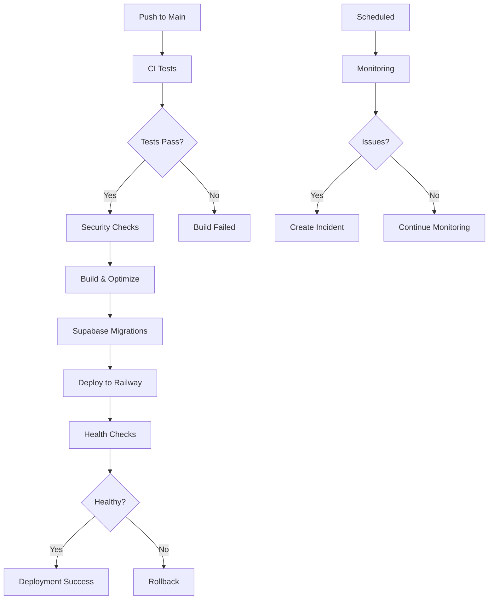

# Puka Reading Tracker - Deployment Guide

This guide covers the complete CI/CD pipeline for deploying Puka to Railway with Supabase integration.

## Table of Contents

1. [Overview](#overview)
2. [Prerequisites](#prerequisites)
3. [Workflow Architecture](#workflow-architecture)
4. [Setup Instructions](#setup-instructions)
5. [Deployment Process](#deployment-process)
6. [Monitoring & Alerts](#monitoring--alerts)
7. [Rollback Procedures](#rollback-procedures)
8. [Troubleshooting](#troubleshooting)

## Overview

The Puka deployment pipeline consists of several GitHub Actions workflows that handle:

- **Automated deployment** on push to main branch
- **Supabase migrations** with TypeScript type generation
- **Security scanning** and dependency checks
- **Production monitoring** with health checks every 15 minutes
- **Rollback capabilities** for quick recovery

## Prerequisites

Before setting up the deployment pipeline, ensure you have:

1. **Railway Account** with a project created
2. **Supabase Project** with database configured
3. **GitHub Repository** with admin access
4. **Required Secrets** configured (see [DEPLOYMENT_SECRETS.md](.github/DEPLOYMENT_SECRETS.md))
5. **Security Setup** completed (see [Security Documentation](.github/security/README.md))

## Workflow Architecture



## Setup Instructions

### 1. Configure GitHub Secrets

Add all required secrets to your repository:

```bash
# Using GitHub CLI
gh secret set RAILWAY_TOKEN
gh secret set RAILWAY_PROJECT_ID
gh secret set SUPABASE_DB_URL
gh secret set VITE_SUPABASE_URL
gh secret set VITE_SUPABASE_ANON_KEY
```

### 2. Configure Railway Project

Ensure your Railway project has:

- Node.js buildpack configured
- Environment variables set
- Health check endpoint configured
- Proper domain setup

### 3. Initialize Supabase

```bash
# Install Supabase CLI
npm install -g supabase

# Login to Supabase
supabase login

# Link your project
supabase link --project-ref your-project-ref

# Create initial migration
supabase migration new initial_schema
```

### 4. Enable Workflows

1. Go to Actions tab in your GitHub repository
2. Enable all workflows
3. Configure environment protection rules for production

## Deployment Process

### Automatic Deployment

Every push to the `main` branch triggers the deployment workflow:

1. **Test Phase**: Runs all unit tests and type checking
2. **Security Phase**: Scans for vulnerabilities
3. **Build Phase**: Creates optimized production build
4. **Migration Phase**: Applies Supabase migrations
5. **Deploy Phase**: Deploys to Railway
6. **Verify Phase**: Runs health checks and smoke tests

### Manual Deployment

To manually trigger a deployment:

1. Go to Actions → Deploy to Railway
2. Click "Run workflow"
3. Select options:
   - Skip migrations (if needed)
   - Target environment

### Monitoring Deployment

View deployment progress:

```bash
# Using Railway CLI
railway logs --follow

# Check deployment status
railway status

# View deployment history
railway deployments
```

## Monitoring & Alerts

### Health Checks

The monitoring workflow runs every 15 minutes and checks:

- HTTP response status
- Response time metrics
- API endpoint availability
- Supabase connectivity

### Incident Management

When issues are detected:

1. **Automatic Issue Creation**: GitHub issue created with incident details
2. **Slack Notifications**: Alert sent to configured webhook
3. **Response Checklist**: Automated checklist for incident response

### Performance Metrics

Monitor these key metrics:

- Page load time (target: <3s)
- Time to First Byte (TTFB)
- API response times
- Database query performance

## Rollback Procedures

### Quick Rollback

For immediate rollback to previous deployment:

1. Go to Actions → Rollback Deployment
2. Run workflow with:
   - Environment: production
   - Rollback count: 1
   - Reason: Brief description

### Specific Version Rollback

To rollback to a specific deployment:

```bash
# Get deployment history
railway deployments

# Rollback to specific ID
railway rollback <deployment-id>
```

### Post-Rollback Actions

After successful rollback:

1. **Investigate** root cause
2. **Fix** the issue in a new branch
3. **Test** thoroughly before redeploying
4. **Document** lessons learned

## Troubleshooting

### Common Issues

#### Deployment Fails

```bash
# Check logs
railway logs --deployment <id>

# Verify environment variables
railway variables

# Check build output
railway logs --build
```

#### Migration Errors

```bash
# Check migration status
supabase migration list --db-url $SUPABASE_DB_URL

# Validate SQL
supabase db diff --db-url $SUPABASE_DB_URL

# Reset migrations (careful!)
supabase db reset --db-url $SUPABASE_DB_URL
```

#### Health Check Failures

1. Verify deployment URL is accessible
2. Check Railway service status
3. Review application logs for errors
4. Confirm environment variables are set

### Debug Commands

```bash
# Test Railway connection
railway whoami

# Check service status
railway status --json | jq

# View recent logs
railway logs --lines 100

# Test Supabase connection
supabase projects list
```

### Emergency Procedures

If critical issues occur:

1. **Immediate Rollback**: Use rollback workflow
2. **Disable Deployments**: Disable push to main
3. **Alert Team**: Use emergency contact procedures
4. **Document Timeline**: Track all actions taken

## Best Practices

### Before Deploying

- [ ] Run tests locally
- [ ] Check for security updates
- [ ] Review migration scripts
- [ ] Update documentation

### During Deployment

- [ ] Monitor deployment logs
- [ ] Watch for error messages
- [ ] Verify health checks pass
- [ ] Check application functionality

### After Deployment

- [ ] Confirm all features work
- [ ] Review performance metrics
- [ ] Update deployment notes
- [ ] Plan next improvements

## Support

For deployment issues:

1. Check workflow logs in GitHub Actions
2. Review Railway deployment logs
3. Consult Supabase dashboard
4. Create issue with deployment tag

## Appendix

### Workflow Files

- **deploy.yml**: Main deployment workflow
- **supabase-migrations.yml**: Migration management
- **security-checks.yml**: Vulnerability scanning
- **monitoring.yml**: Production health checks
- **rollback.yml**: Emergency rollback

### Environment Variables

Production environment requires:

```env
NODE_ENV=production
VITE_APP_ENV=production
VITE_APP_VERSION=<git-sha>
VITE_SUPABASE_URL=<from-secret>
VITE_SUPABASE_ANON_KEY=<from-secret>
```

### Useful Links

- [Railway Documentation](https://docs.railway.app)
- [Supabase CLI Reference](https://supabase.com/docs/reference/cli)
- [GitHub Actions Documentation](https://docs.github.com/en/actions)
- [Security Documentation](.github/security/README.md)
- [Security Policy](SECURITY.md)