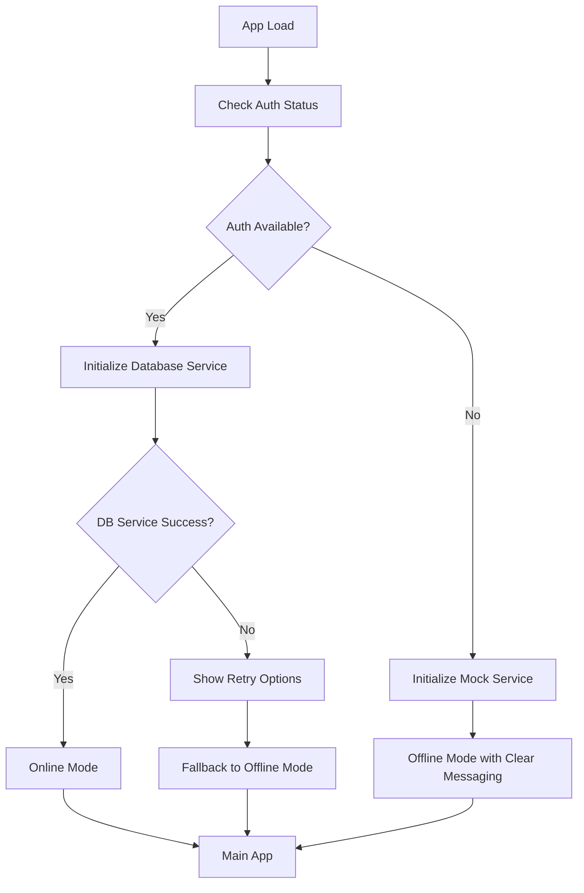
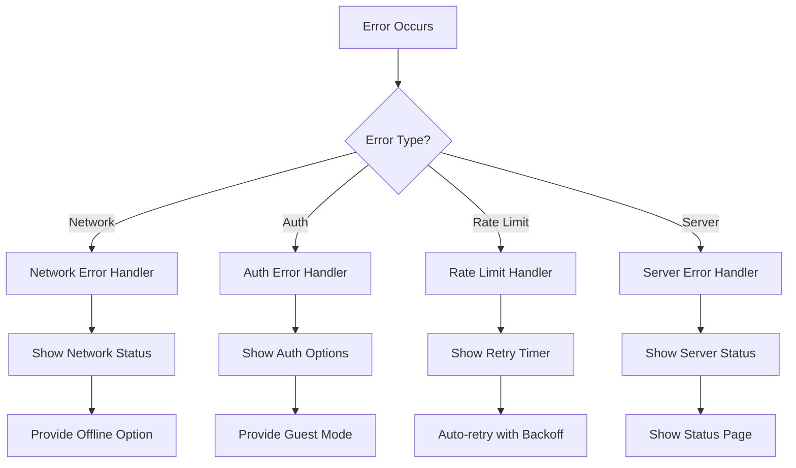

# Design Document

## Overview

This design addresses critical production UX issues in the Puka Reading Tracker application, focusing on robust authentication, improved error handling, better loading states, and seamless offline functionality. The solution emphasizes graceful degradation and clear user communication throughout all failure scenarios.

## Architecture

### Authentication Flow Enhancement



### Error Handling Strategy



## Components and Interfaces

### Enhanced Authentication Components

#### AuthenticationManager

```typescript
interface AuthenticationManager {
  // Enhanced authentication with retry logic
  signIn(credentials: Credentials): Promise<AuthResult>
  signUp(userData: UserData): Promise<AuthResult>
  checkAuthStatus(): Promise<AuthStatus>

  // Rate limiting and retry management
  handleRateLimit(retryAfter: number): void
  retryWithBackoff(operation: () => Promise<any>): Promise<any>
}

interface AuthResult {
  success: boolean
  error?: AuthError
  user?: User
  requiresRetry?: boolean
  retryAfter?: number
}

interface AuthError {
  type: 'NETWORK' | 'CREDENTIALS' | 'RATE_LIMIT' | 'SERVER' | 'UNKNOWN'
  message: string
  userMessage: string
  actionable: boolean
  retryable: boolean
}
```

#### ErrorBoundary Enhancement

```typescript
interface ErrorBoundaryState {
  hasError: boolean
  error?: Error
  errorInfo?: ErrorInfo
  errorType: 'AUTH' | 'NETWORK' | 'STORAGE' | 'UNKNOWN'
  recoveryOptions: RecoveryOption[]
}

interface RecoveryOption {
  label: string
  action: () => void
  primary: boolean
}
```

### Loading State Management

#### LoadingStateManager

```typescript
interface LoadingStateManager {
  setLoading(key: string, message?: string): void
  clearLoading(key: string): void
  setProgress(key: string, progress: number): void
  setTimeout(key: string, timeout: number, fallback: () => void): void
}

interface LoadingState {
  isLoading: boolean
  message?: string
  progress?: number
  timeout?: number
  startTime: number
}
```

### Storage Service Enhancement

#### StorageServiceManager

```typescript
interface StorageServiceManager {
  // Service selection and fallback
  initializeService(): Promise<StorageService>
  switchToOfflineMode(): void
  attemptOnlineReconnection(): Promise<boolean>

  // State management
  getServiceStatus(): ServiceStatus
  onServiceChange(callback: (status: ServiceStatus) => void): void
}

interface ServiceStatus {
  type: 'DATABASE' | 'MOCK'
  online: boolean
  lastSync?: Date
  pendingSync: boolean
  error?: string
}
```

## Data Models

### Enhanced Error Models

```typescript
interface UserFriendlyError {
  id: string
  type: ErrorType
  title: string
  message: string
  details?: string
  actions: ErrorAction[]
  dismissible: boolean
  persistent: boolean
}

interface ErrorAction {
  label: string
  action: () => void | Promise<void>
  style: 'primary' | 'secondary' | 'danger'
  loading?: boolean
}

enum ErrorType {
  AUTHENTICATION = 'authentication',
  NETWORK = 'network',
  RATE_LIMIT = 'rate_limit',
  SERVER = 'server',
  STORAGE = 'storage',
}
```

### Service State Models

```typescript
interface AppState {
  authStatus: AuthStatus
  serviceStatus: ServiceStatus
  loadingStates: Record<string, LoadingState>
  errors: UserFriendlyError[]
  offlineMode: boolean
}

interface AuthStatus {
  isAuthenticated: boolean
  user?: User
  loading: boolean
  error?: AuthError
  lastCheck: Date
}
```

## Error Handling

### Centralized Error Management

- **ErrorManager**: Central service for handling, categorizing, and displaying errors
- **Error Classification**: Automatic categorization of errors with appropriate user messaging
- **Recovery Actions**: Context-aware recovery options for each error type
- **Error Persistence**: Track recurring errors to improve user experience

### Rate Limiting Strategy

- **Exponential Backoff**: Implement exponential backoff for rate-limited requests
- **User Communication**: Clear messaging about rate limits with countdown timers
- **Graceful Degradation**: Automatic fallback to offline mode during extended rate limiting
- **Request Queuing**: Queue non-critical requests during rate limit periods

### Network Error Handling

- **Connection Detection**: Monitor network connectivity status
- **Offline Indicators**: Clear visual indicators when offline
- **Request Retry**: Automatic retry of failed requests when connectivity returns
- **Sync Management**: Queue offline changes for synchronization

## Testing Strategy

### Error Scenario Testing

- **Rate Limit Simulation**: Test app behavior under various rate limiting scenarios
- **Network Failure**: Test offline functionality and recovery
- **Authentication Failures**: Test various auth failure modes
- **Service Degradation**: Test fallback mechanisms

### User Experience Testing

- **Error Message Clarity**: Verify error messages are user-friendly and actionable
- **Loading State Behavior**: Test loading timeouts and fallback states
- **Mobile Responsiveness**: Test error handling on mobile devices
- **Accessibility**: Ensure error states are accessible

### Performance Testing

- **Retry Logic**: Test exponential backoff doesn't impact performance
- **Memory Usage**: Monitor error state management memory usage
- **Loading Timeouts**: Verify appropriate timeout values

## Implementation Phases

### Phase 1: Core Error Infrastructure

- Implement ErrorManager and error classification system
- Create enhanced ErrorBoundary with recovery options
- Add LoadingStateManager with timeout handling

### Phase 2: Authentication Enhancement

- Implement retry logic and rate limit handling
- Add exponential backoff for auth requests
- Create user-friendly auth error messages

### Phase 3: Storage Service Improvements

- Enhance service fallback mechanisms
- Add clear offline mode indicators
- Implement sync status communication

### Phase 4: UI/UX Polish

- Design and implement error UI components
- Add loading state animations and progress indicators
- Implement mobile-responsive error handling

### Phase 5: Testing and Optimization

- Comprehensive error scenario testing
- Performance optimization of error handling
- User acceptance testing of error flows

## Success Metrics

### Technical Metrics

- Reduce authentication failure rate by 80%
- Eliminate indefinite loading states
- Achieve <2 second error recovery time
- 100% error scenario test coverage

### User Experience Metrics

- Increase successful sign-up rate by 60%
- Reduce user confusion during errors (measured by support tickets)
- Improve mobile error handling satisfaction
- Achieve 95% error message clarity rating

## Security Considerations

- **Error Information Disclosure**: Ensure error messages don't leak sensitive information
- **Rate Limit Bypass Prevention**: Implement client-side rate limiting to prevent abuse
- **Offline Data Security**: Secure offline data storage and sync
- **Authentication Token Management**: Proper handling of expired or invalid tokens
