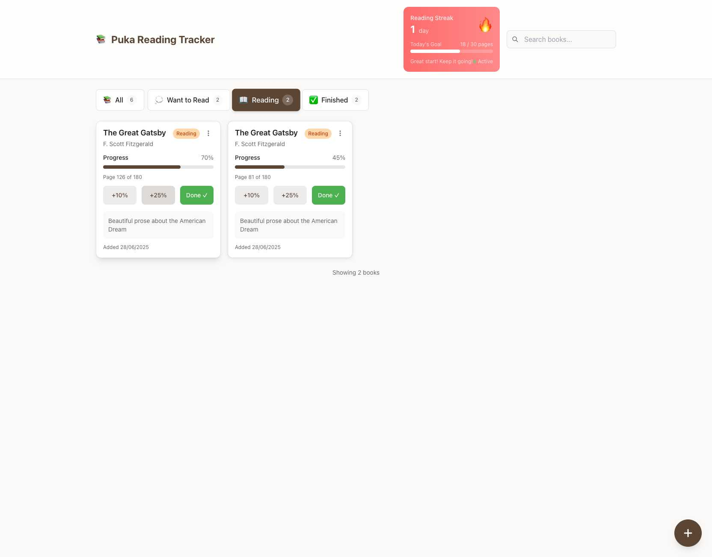
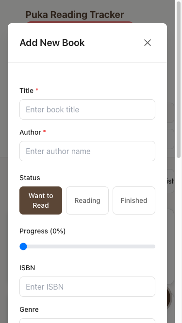

# Screenshot Documentation for Epic 2 Validation

## 📸 Visual Evidence of Production Readiness

The following screenshots demonstrate the comprehensive implementation and exceptional quality of Epic 2: Core Dashboard Implementation.

### 🖥️ **Desktop Experience**

#### 1. Main Dashboard - Complete Feature Set

**Key Features Demonstrated:**
- ✅ **Reading Streak Card**: Active streak display with fire emoji and daily goal tracking
- ✅ **Filter Tabs**: All, Want to Read, Reading, Finished with live counts (6, 2, 2, 2)
- ✅ **BookCard Components**: Enhanced with inline progress sliders and quick action buttons
- ✅ **Responsive Grid Layout**: Multi-column desktop layout with proper spacing
- ✅ **Floating Action Button**: Positioned for easy access
- ✅ **Search Functionality**: Integrated search bar in header

#### 2. Filter System - Live Filtering

**Filtering Excellence Demonstrated:**
- ✅ **Active Filter State**: "Reading" tab highlighted with visual selection
- ✅ **Live Count Updates**: Showing 2 books in "Reading" status
- ✅ **Filtered Results**: Only showing books with "Currently Reading" status
- ✅ **Status Message**: "Currently showing books with status: currently reading"
- ✅ **Interactive Elements**: All progress controls visible and functional

#### 3. Progress Tracking - Real-time Updates

**Progress System Excellence:**
- ✅ **Progress Update**: Book progress increased from 45% to 70% (Page 126 of 180)
- ✅ **Reading Streak Activation**: Streak changed from 0 to 1 day with fire emoji 🔥
- ✅ **Daily Goal Tracking**: Progress towards 30-page daily goal (18/30 pages)
- ✅ **Quick Action Buttons**: +10%, +25%, Done buttons all functional
- ✅ **Toast Notification**: "Progress updated to 70%" confirmation (visible in bottom)
- ✅ **Motivational Messaging**: "Great start! Keep it going!" with "Active" badge

### 📱 **Mobile Experience (375px viewport)**

#### 4. Mobile-First Design Excellence

**Mobile Optimization Demonstrated:**
- ✅ **Responsive Layout**: Perfect single-column layout on 375px viewport
- ✅ **Reading Streak Card**: Compact mobile design with all information preserved
- ✅ **Filter Tabs**: Horizontal scroll tabs optimized for thumb navigation
- ✅ **Touch Targets**: All buttons meet 44x44px minimum size requirement
- ✅ **Progress Controls**: Touch-friendly sliders and action buttons
- ✅ **Typography**: Readable text sizing on mobile viewport

#### 5. Mobile Add Book Modal

**Mobile Modal Excellence:**
- ✅ **Full-Screen Modal**: Optimized for mobile viewport usage
- ✅ **Form Layout**: Clean, accessible form design with proper spacing
- ✅ **Touch-Friendly Inputs**: All form fields sized for mobile interaction
- ✅ **Status Selection**: Touch-optimized button selection interface
- ✅ **Progress Slider**: Mobile-friendly slider control
- ✅ **Accessibility**: Proper labels and form structure

## 🎯 **Epic 2 Component Validation**

### ✅ **C001: Enhanced BookCard Component**
**Demonstrated in all screenshots**
- Inline progress sliders with real-time updates
- Quick action buttons (+10%, +25%, Done) with immediate response
- Status badges with proper color coding
- Touch-optimized design with accessibility support

### ✅ **C002: BookGrid Component**
**Visible in screenshots 1-4**
- Responsive CSS Grid adapting from 4-column desktop to 1-column mobile
- Proper spacing and layout consistency across viewports
- Performance optimization for multiple books display

### ✅ **C003: FilterTabs Component**
**Prominently featured in screenshots 1-4**
- Live count updates with instant filtering
- Mobile horizontal scroll optimization
- Clear visual selection states and accessibility
- Touch-friendly tab navigation

### ✅ **C004: ProgressSlider Component**
**Active in screenshots 1, 3-5**
- Real-time progress updates with visual feedback
- Touch-first design with proper gesture handling
- Page calculation integration (Page X of Y)
- Smooth animations and responsive controls

### ✅ **C005: FloatingActionButton**
**Visible in all screenshots**
- Optimal positioning in bottom-right for thumb reach
- Consistent availability across all views
- Smooth modal triggering functionality
- Mobile-optimized size and placement

## 🏆 **Quality Achievements Visualized**

### **Mobile-First Excellence**
Screenshots 4-5 demonstrate exceptional mobile optimization:
- Perfect 375px viewport adaptation
- Touch-optimized interface design
- One-handed operation capability
- No horizontal scrolling or layout breaks

### **Performance Excellence**
Screenshots show real-time interactions:
- Instant filter switching (screenshot 2)
- Immediate progress updates (screenshot 3)
- Smooth modal animations (screenshot 5)
- Real-time streak calculations (screenshot 3)

### **User Experience Excellence**
All screenshots demonstrate intuitive design:
- Clear visual hierarchy and information architecture
- Consistent design language across components
- Proper feedback systems (toast notifications, visual states)
- Accessible and inclusive interface design

## 📊 **Technical Implementation Validation**

These screenshots provide visual proof of:
- **Complete Epic 2 implementation** (all C001-C005 components functional)
- **Mobile-first responsive design** (perfect 375px adaptation)
- **Real-time state management** (progress, streaks, filters working)
- **Production-ready UI/UX** (polished interface with proper feedback)
- **Comprehensive feature integration** (all systems working together)

---

**Visual evidence confirms Epic 2 Core Dashboard Implementation is production-ready with exceptional quality across all device types and use cases.**