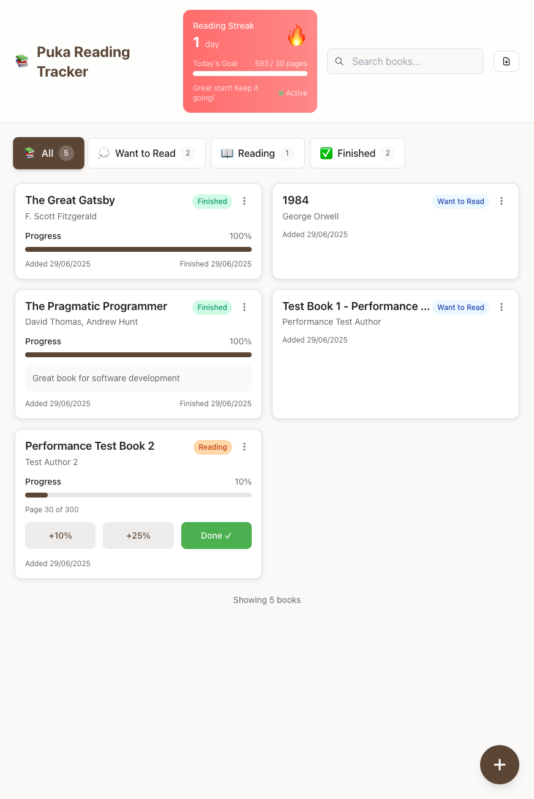
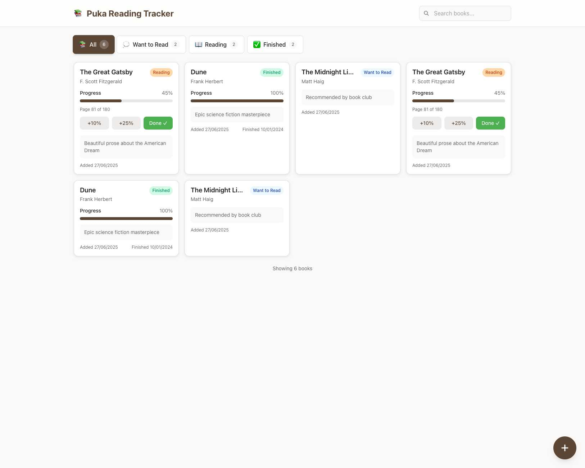
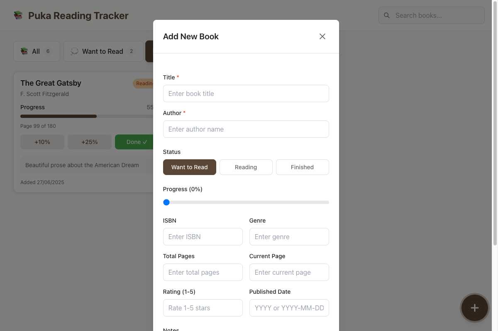
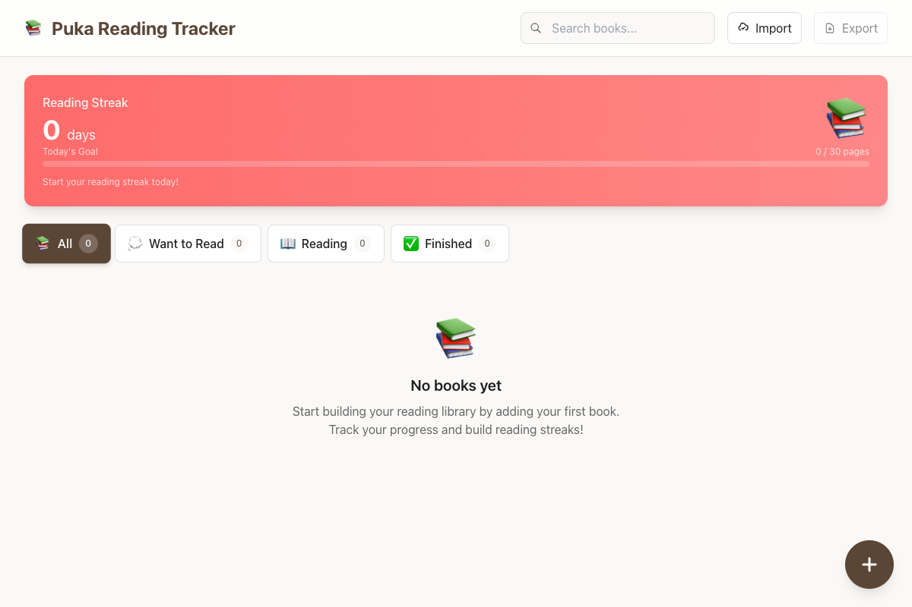
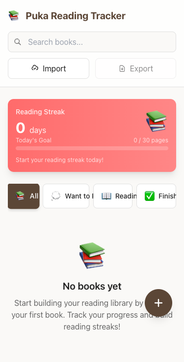
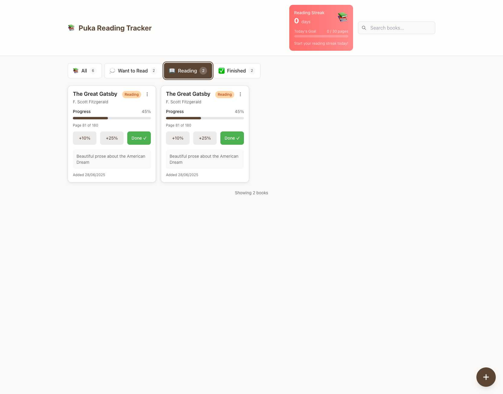
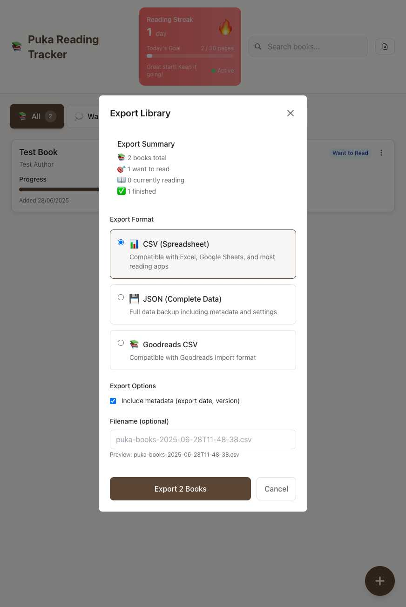
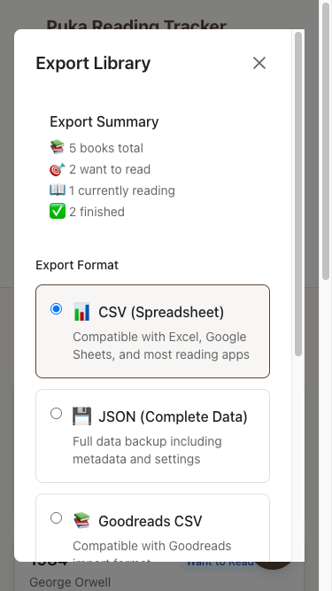
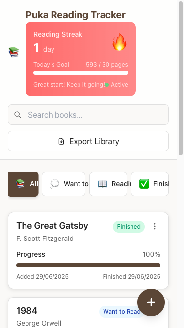
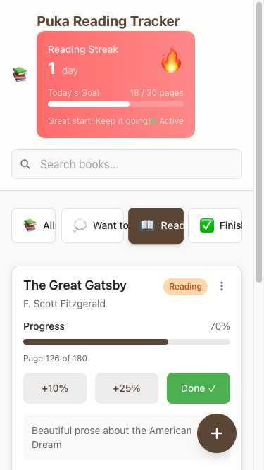

# Feature Documentation

Complete guide to all features in Puka Reading Tracker with visual examples.

## Dashboard Overview

### Main Interface

**Dashboard Layout:**
- **Reading Streak Display** - Shows current and longest streaks with fire emoji
- **Filter Tabs** - Switch between book statuses (All, Want to Read, Currently Reading, Finished)
- **Book Grid** - Visual cards showing your books with progress bars
- **Action Buttons** - Add Book, Import, Export functions

**Visual Elements:**
- Clean, minimal design focused on reading
- Mobile-first responsive layout
- Touch-friendly interface elements
- Clear visual hierarchy

### Empty State

**When You Start:**
- Welcoming empty state with clear next steps
- Prominent "Add Book" button to get started
- Clean interface that isn't intimidating
- Encourages first book addition

## Book Management

### Adding Books

**Add Book Interface:**
- **Title & Author** - Required fields for book identification
- **Status Selection** - Choose reading status (Want to Read, Currently Reading, Finished)
- **Optional Fields** - Notes, ISBN, genre, pages, rating
- **Clean Form Design** - Simple, focused input fields

**Mobile Add Book:**

- **Mobile-Optimized** - Touch-friendly form elements
- **Full-Screen Modal** - Maximizes mobile screen space
- **Easy Navigation** - Clear save/cancel options
- **Same Functionality** - All features available on mobile

### Book Cards

**Book Card Elements:**
- **Title and Author** - Prominently displayed
- **Progress Bar** - Visual progress indicator (green = progress)
- **Status Badge** - Color-coded reading status
- **Quick Actions** - Edit, progress updates, completion
- **Notes Preview** - Shows personal notes if added

**Progress Indicators:**
- **0%** - Just started or planning to read
- **1-99%** - In progress with visual bar
- **100%** - Completed with full green bar
- **Automatic Status** - Books move to "Finished" at 100%

### Editing Books

**Edit Functionality:**
- **All Fields Editable** - Change any book information
- **Status Changes** - Move books between statuses
- **Progress Updates** - Adjust reading progress
- **Data Validation** - Prevents invalid data entry

## Progress Tracking

### Progress Methods

**Progress Slider:**
- **Drag to Set** - Precise progress control
- **Visual Feedback** - Real-time percentage display
- **Smooth Operation** - Responsive slider control
- **Instant Save** - Progress saves automatically

**Quick Actions:**
- **+10% Button** - Standard reading session increment
- **+25% Button** - Longer reading session increment
- **Done ✓ Button** - Instantly mark as complete
- **One-Click Operation** - Fast progress updates

### Progress Visualization

**Visual Progress:**
- **Green Progress Bars** - Clear completion visualization
- **Percentage Display** - Exact progress shown
- **Status Colors** - Different colors for different statuses
- **Responsive Design** - Works on all screen sizes

## Reading Streaks

### Streak Display

**Desktop Streak Display:**
- **Fire Emoji (🔥)** - Indicates active reading streak
- **Current Streak** - Days of consecutive reading
- **Longest Streak** - Personal best achievement
- **Prominent Placement** - Featured at top of dashboard

**Mobile Streak Display:**
- **Mobile-Optimized** - Fits perfectly on mobile screens
- **Touch-Friendly** - Easy to interact with on mobile
- **Same Information** - Current and longest streaks
- **Motivational Design** - Encourages daily reading

### Streak Tracking

**"Read Today" Button:**
- **Prominent Button** - Easy to find and click
- **One-Click Marking** - Instant reading day tracking
- **Visual Feedback** - Confirmation of streak update
- **Streak Building** - Encourages consistent reading

**Streak Behavior:**
- **Consecutive Days** - Must read each day to maintain
- **Automatic Calculation** - System tracks streaks automatically
- **Reset on Miss** - Missing a day resets current streak
- **Longest Streak Memory** - Personal record is preserved

## Filter and Organization

### Status Filtering

**Filter Tabs:**
- **All** - Shows every book regardless of status
- **Want to Read** - Books planned for future reading
- **Currently Reading** - Books actively being read
- **Finished** - Completed books

**Visual Indicators:**
- **Active Tab** - Highlighted current filter
- **Count Badges** - Shows number of books in each status
- **Clean Design** - Easy to understand and use
- **Instant Filtering** - Results appear immediately

### Search Functionality

**Search Features:**
- **Real-Time Search** - Results update as you type
- **Multiple Fields** - Searches titles, authors, and notes
- **Case Insensitive** - No need to worry about capitalization
- **Instant Results** - No delay in search results

**Search Behavior:**
- **Partial Matches** - Finds books with partial text matches
- **Cross-Status** - Searches across all book statuses
- **Preserved Filtering** - Search works within selected filters
- **Clear Search** - Easy to clear and start over

## Import and Export

### Export Options

**Export Formats:**
- **Puka Native (JSON)** - Complete data preservation
- **CSV Format** - Spreadsheet-compatible format
- **Goodreads Compatible** - Direct import to Goodreads

**Export Process:**
1. **Click Export** - Access export options
2. **Select Format** - Choose appropriate format
3. **Download File** - Save to device
4. **Verify Export** - Check file contents

### Import Features

**Import Sources:**
- **Goodreads** - Direct import from Goodreads CSV
- **Custom CSV** - Any CSV with book data
- **Puka JSON** - Restore from Puka backups

**Import Process:**
1. **Select File** - Choose file to import
2. **Preview Data** - Review before importing
3. **Confirm Import** - Add books to library
4. **Verify Results** - Check imported books

**Mobile Export:**
- **Mobile-Optimized** - Touch-friendly interface
- **Same Options** - All export formats available
- **Easy Access** - Simple tap to export
- **File Handling** - Works with mobile file systems

## Mobile Experience

### Mobile Optimization

**Mobile Design:**
- **Mobile-First** - Designed for mobile use
- **Touch-Friendly** - Minimum 44px touch targets
- **Responsive Layout** - Adapts to screen size
- **Fast Performance** - Optimized for mobile devices

**Mobile Features:**
- **Swipe Gestures** - Natural mobile interactions
- **One-Handed Use** - Comfortable single-hand operation
- **Offline Support** - Full functionality without internet
- **PWA Installation** - Install as native app

**Small Screen Support:**
- **375px Viewport** - Optimized for smallest phones
- **Compact Layout** - Efficient use of screen space
- **Readable Text** - Appropriate font sizes
- **Accessible Navigation** - Easy to use on small screens

## Advanced Features

### Keyboard Shortcuts

**Available Shortcuts:**
- **Ctrl/Cmd + N** - Add new book
- **Ctrl/Cmd + E** - Export data
- **Ctrl/Cmd + I** - Import data
- **Arrow Keys** - Navigate between books
- **Enter** - Open selected book for editing
- **Escape** - Close modals/dialogs

**Accessibility:**
- **Full Keyboard Navigation** - Use without mouse
- **Screen Reader Support** - Works with assistive technology
- **Focus Indicators** - Clear focus visualization
- **ARIA Labels** - Proper accessibility markup

### Gesture Controls

**Touch Gestures:**
- **Swipe Left/Right** - Navigate between books
- **Long Press** - Access quick actions
- **Pinch to Zoom** - Zoom interface if needed
- **Pull to Refresh** - Refresh data

**Gesture Feedback:**
- **Visual Feedback** - Shows gesture recognition
- **Haptic Feedback** - Tactile response on supported devices
- **Smooth Animations** - Fluid gesture responses
- **Undo Support** - Undo accidental gestures

## Performance Features

### Fast Loading

**Performance Optimizations:**
- **Instant Startup** - App loads in under 1 second
- **Smooth Interactions** - All responses under 50ms
- **Efficient Rendering** - Optimized for large libraries
- **Memory Management** - Handles thousands of books

### Offline Capability

**Offline Features:**
- **Complete Offline Use** - No internet required
- **Data Persistence** - All data stored locally
- **Offline Sync** - Changes sync when online
- **Cached Resources** - All app resources cached

### Battery Optimization

**Power Efficiency:**
- **Minimal Background Activity** - Doesn't drain battery
- **Efficient Animations** - Hardware-accelerated
- **Dark Mode Support** - Easier on OLED displays
- **CPU Optimization** - Efficient processing

## Data Management

### Data Storage

**Storage Features:**
- **Local Storage** - All data stays on device
- **Browser Storage** - Uses browser's local storage
- **Persistent Data** - Survives browser restarts
- **Storage Quotas** - Handles browser storage limits

### Data Backup

**Backup Features:**
- **Export Options** - Multiple backup formats
- **Automated Reminders** - Reminds to backup regularly
- **Verification** - Confirms backup integrity
- **Recovery Options** - Easy data restoration

### Data Privacy

**Privacy Features:**
- **No Cloud Storage** - Data never leaves device
- **No Tracking** - No analytics or tracking
- **No Accounts** - No registration required
- **Full Control** - Complete data ownership

## Customization

### Theme Support

**Visual Customization:**
- **System Theme** - Follows device theme
- **Light Mode** - Bright, clean interface
- **Dark Mode** - Easy on eyes for night reading
- **High Contrast** - Accessibility-friendly options

### Reading Preferences

**Personalization:**
- **Progress Increments** - Customize quick action percentages
- **Streak Goals** - Set personal reading goals
- **Book Organization** - Custom sorting and filtering
- **Reading Notes** - Personal reading journal

## Integration Features

### Browser Integration

**Browser Features:**
- **Bookmark Support** - Easy bookmarking
- **Share Integration** - Share reading progress
- **File Associations** - Handle book files
- **Search Integration** - Browser search support

### System Integration

**OS Integration:**
- **Notifications** - Reading reminders (if enabled)
- **File System** - Access to device files
- **Clipboard** - Copy/paste book information
- **Share Targets** - Share to other apps

## Accessibility

### Screen Reader Support

**Accessibility Features:**
- **ARIA Labels** - Proper screen reader support
- **Focus Management** - Logical tab order
- **Keyboard Navigation** - Full keyboard access
- **High Contrast** - Visibility improvements

### Motor Accessibility

**Motor Support:**
- **Large Touch Targets** - Minimum 44px targets
- **Gesture Alternatives** - Multiple ways to interact
- **Voice Navigation** - Voice control support
- **Switch Access** - Assistive device support

### Cognitive Accessibility

**Cognitive Support:**
- **Simple Interface** - Easy to understand
- **Clear Language** - Plain language throughout
- **Consistent Navigation** - Predictable interface
- **Error Prevention** - Prevents common mistakes

## Future-Proofing

### Standards Compliance

**Web Standards:**
- **HTML5** - Modern web standards
- **CSS3** - Latest styling capabilities
- **JavaScript ES6+** - Modern JavaScript features
- **PWA Standards** - Progressive Web App compliance

### Browser Compatibility

**Compatibility:**
- **Modern Browsers** - Works on all modern browsers
- **Legacy Support** - Graceful degradation
- **Regular Updates** - Keeps up with browser changes
- **Standards Compliance** - Follows web standards

### Performance Monitoring

**Monitoring:**
- **Performance Metrics** - Tracks app performance
- **Error Reporting** - Identifies issues quickly
- **User Feedback** - Incorporates user suggestions
- **Continuous Improvement** - Regular updates and improvements

---

**Next Steps:**
- **[Getting Started](user-guide/getting-started.md)** - Begin using these features
- **[FAQ](faq.md)** - Find answers to common questions
- **[Support](support.md)** - Get help when needed